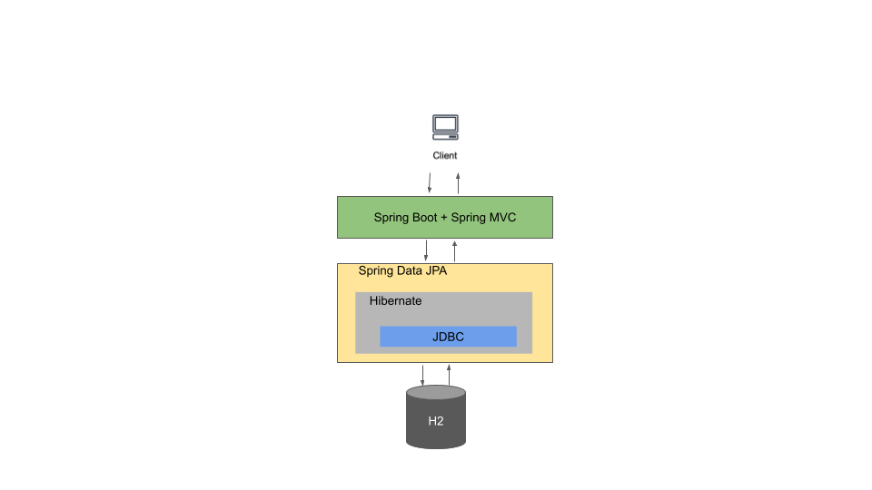

# Donation Inventory Management

## Features
- Users can create, update, and delete a donation
## Technical Specs

### Back-end

<figure>
  
  <figcaption align="middle">High level infrastructure</figcaption>
</figure>

* Separation of concerns by applying MVC model
* Data persisted in in-memory database H2. Therefore, data would be wiped out every app run
* User inputs validation at both FE and BE

### Front-end
* Tech used: React, Material-UI, Bootstrap
* Form validation with Formik and Yup
* Create snapshot tests with Jest
* Factor User Input Form into a separate component and reuse it in a couple of places

## How to run
Clone the project
```bash
git clone https://github.com/trevor-tran/donationinventory.git
```
#### Run Backend
 - It should be as simple as run a Java application. Open the application with your IDE and run the app.
 - If you run into issues, please follow the section [19.1](https://docs.spring.io/spring-boot/docs/1.5.16.RELEASE/reference/html/using-boot-running-your-application.html) instructions.

#### Run Frontend
Do the following steps:
```bash
cd donationinventory/app
npm install
npm start
```